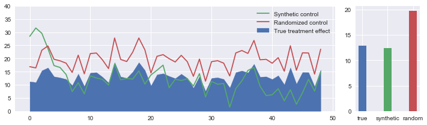

# synthetic-control-project

Synthetic control is an application of predictive modeling in causal inference. When the outcome of the control group is dependent on the outcome of the treatment group, the treatment effect cannot be accurately estimate. This is where predictive modeling can help to construct a synthetic treatment group where the outcome is entirely predicted and not observed.

In this project, I will explain what synthetic control is and demonstrate how it can be used to better estimate the effects of a marketing campaign on sales when a control group cannot be properly created. [Click here](https://github.com/TheShiya/synthetic-control-project/blob/master/synth_control.ipynb) for the code.

